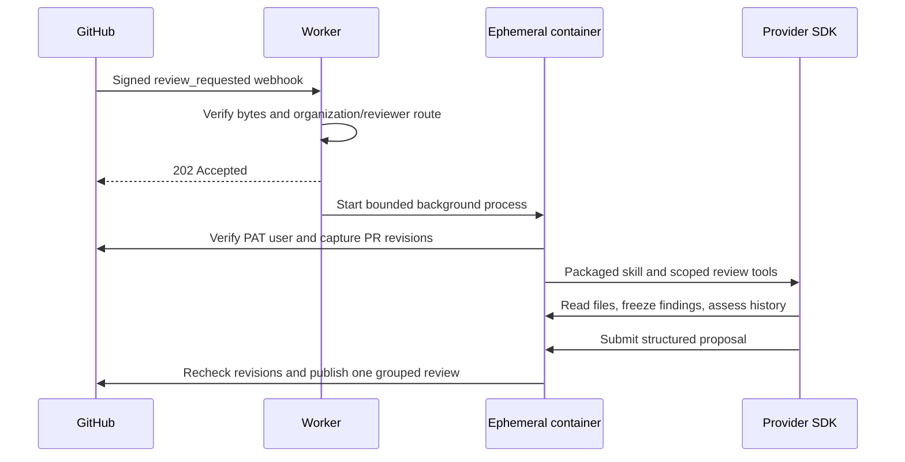

# How a review runs

The public HTTP layer is a [Hono application](https://hono.dev/docs/getting-started/cloudflare-workers).
`src/app.ts` composes `GET /health` (with Hono's automatic `HEAD` support),
`POST /webhooks/github/:hook`, no-store headers, and sanitized JSON errors. Unsupported webhook
methods receive `405` with `Allow: POST`; unmatched paths receive `404`. `src/index.ts` injects the
container launcher and exports the app for Cloudflare's fetch handler. No separate listening server
is needed for the Worker. The container's private loopback tool server remains a Node implementation.

The Worker uses `waitUntil` only for container startup. Worker background work
has a limited lifetime, so the actual SDK session runs as a Sandbox background
process. The container's idle timeout exceeds the configured review deadline.
See [Worker limits](https://developers.cloudflare.com/workers/platform/limits/)
and
[Sandbox lifecycle](https://developers.cloudflare.com/sandbox/concepts/sandboxes/).

`202` acknowledges acceptance into background startup, not durable admission. A
platform interruption or startup failure can lose a run. Nothing resumes it.
This is the intentional tradeoff of a fire-and-forget service without storage.

`worker/handler.ts` handles authentication and dispatch. Runtime-independent configuration and
review types live in `contracts/`. The runner verifies and reads the packaged skill through
`runner/skill.ts`; `runner/instructions.md` supplies build-embedded host instructions around it.
Each runner/MCP process parses its environment once into typed settings and passes those settings
to tools and provider invocations, including specialists. Broker credentials are passed explicitly
without adding them to the parent process environment.

## Boundaries

The webhook signature is verified over original bytes before JSON parsing. The
payload's base owner ID, owner login, repository ID, and requested reviewer ID
must match the configured route. The PAT is selected from that route and
verified against GitHub. No credential is selected from a fork or a model
response.

Each run has a fresh container, an empty agent working directory, and the
packaged skill. The provider has only the review MCP tools. Shell access,
repository installation, native delegation, and project settings are disabled in
the adapters. Source files are fetched at immutable GitHub revisions. The PAT
stays inside the parent runner process and is removed from its environment
before agent subprocesses start. Provider subprocesses receive an explicitly
constructed environment with their own API key and a scoped loopback tool
credential.

A local HTTP server binds only to `127.0.0.1`. It shares transient review state
across MCP subprocesses and independently scoped specialists. It has no public
Worker route and no data store. GitHub-derived content remains untrusted
evidence; schema validation and tool restrictions do not prove a model's
findings correct.

The lead freezes independent findings before it can access external review text.
The host validates the proposed verdict against the packaged skill's decision
policy, checks coverage and inline anchors, and rechecks PR revisions and review
eligibility before publication. Reading history cannot modify the frozen
evidence.

## Publication and re-reviews

One run can attempt one grouped `createReview` call. The in-memory submission
flag is set before awaiting the final GitHub check, preventing overlapping tool
calls from publishing twice within the process. A response failure does not
clear it. Inline links, when needed, are filled in by one subsequent edit to
that newly created review. Neither mutation is retried.

Earlier automation reviews are identified for reading by their author ID and
application marker. Markers do not authorize editing old reviews: this host
never dismisses or changes previous reviews or threads. Human reviews from the
same PAT account are excluded from automation history unless reading external
history. Every re-request reassesses current code; it is not a resume operation.

There is no cross-run lock, stored delivery ID, or exactly-once guarantee. Two
accepted webhook deliveries can run concurrently. Head/base checks narrow stale
publication risk but cannot make GitHub reads and writes atomic. Repository
branch protection remains responsible for enforcing merge policy.

## What is retained

The application persists no jobs, proposals, findings, tokens, or usage records.
GitHub retains submitted reviews. Cloudflare manages container lifecycle
metadata and configured platform logs. Provider services have their own account
retention policies. Agent SDKs can write temporary session files inside the
ephemeral container; they disappear when that container is discarded.
